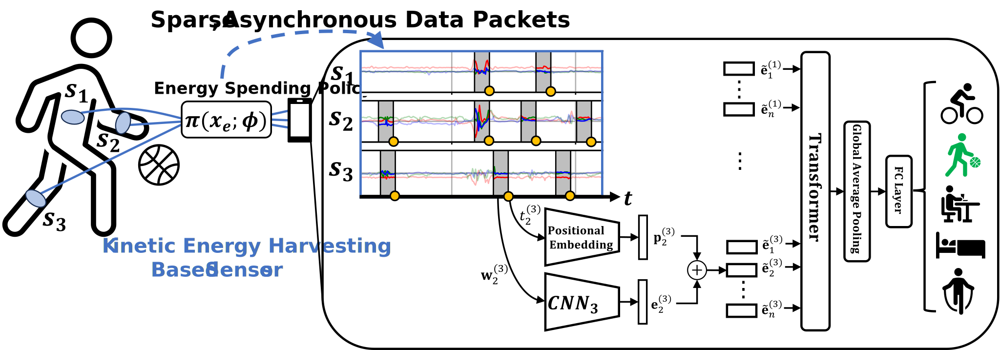
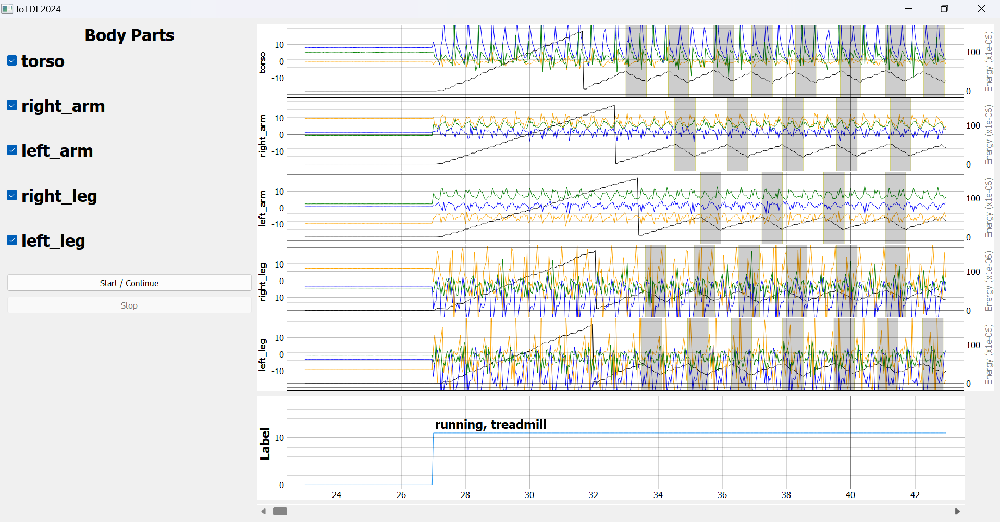

# beyond_thresholds
(IoTDI 2024) Demo Abstract: A Prototype for Machine Learning with Batteryless Sensors



This repo consists of an interactive GUI for simulating the data acquisition process for kinetic energy harvesting based sensors.

# Environment Setup  
Create a conda environment for simulating data acquisition with batteryless sensors  
```
conda create --name bml python=3.10
conda activate bml
```  

Install the necessary packages  
```
conda install pyqt
conda install pyqtgraph
conda install pandas
conda install scipy
```

# Run the GUI
```python iotdi_demo.py ```